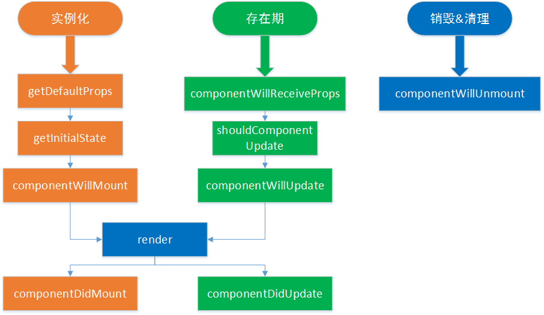

# 该文件介绍了一些React的基本语法，详细如下：

### JSX语法
- HTML 语言直接写在 JavaScript 语言之中，不加任何引号，这就是 JSX 的语法，它允许 HTML 与 JavaScript 的混写，用于描述组件树
- 在JSX语法中，变量的引入使用{}来进行变量的引入
- 遇到 HTML 标签（以 < 开头），就用 HTML 规则解析；遇到代码块（以 { 开头），就用 JavaScript 规则解析

```
    var names = ['Anna','Jhon','Alice'];
    class App extends React.Component {
        render(){
            return <div>
            {
                names.map(function(name){
                    return <div>Hello,{name}</div>
                })
            }
            </div>
        }
    }
```
- 如果是一个数组，可以直接使用变量将数组中的内容都进行显示

```
    render(){
        return <div>{names}</div>
    }
```
- JSX中的注释使用如下语法：

```
    return (
        <h1>Hello JSX,{name}
            {/*
             这里是JSX的注释
             */}
        </h1>
    )

```
---
### 组件样式的定义
- 定义组件样式有两种，一种是引入样式文件，一种是直接在组件内写样式对象

```
    index.css 文件中内容
    .container{background-color: lightgreen;color:#fff;}
    
    index.js 文件中内容
    import "./index.css"      // 通过样式文件引入
    class App extends Component {
        render(){
            var fontStyle = {       // 组件内写样式对象
                fontSize:'30px'
            }
            return <h1 className="container" style={fontStyle}>Hello World</h1>
        }
    }
```
---
### 使用ES5来进行组件定义

```
    var React = require('react');
    var ReactDOM = require('react-dom');
    
    var App = React.createClass({
        render: function () {
            return <h1>Hello World</h1>
        }
    })
    
    ReactDOM.render(<App />,document.getElementById('app'))
```
---
### render方法，用于对页面内容的渲染

```
    render(){
        return (
            <div>
                <h1>11</h1>
                <h1>22</h1>
            </div>
        )
    }
```
---
### 组件的属性
- props  用于组件间的数据传递
- state  用于管理组件自己内部的数据
- props:一般用于父组件向子组件通信，在组件之间通信使用
- state:一般用于组件内部的状态维护，更新组建内部的数据，状态，更新子组件的props等

- 将父组件的数据传递给子组件（基本的数据传递）

```
    index.js
    
    class App extends Component {
        render(){
            var data = {
                "name": "zj135808",
                "id": 19897852,
                "avatar_url": "https://avatars.githubusercontent.com/u/19897852?v=3"
            };
            return (
                 <Profile name={data.name} id={data.id} url={data.avatar_url}/>
            )
        }
    }


    Profiles.js
    
    export default class Profile extends Component{
        render (){
            let data = this.props;
            return (
                <div>
                    
                    <h1>{this.props.name}</h1>
                    <h2>{this.props.id}</h2>
                </div>
            )
        }
    }
```
- 为子组件设置传递数据的类型
- 注：需要将PropTypes进行引入

```
    import React, {Component,PropTypes} from 'react'
    
    Profile.propTypes = {
        url:PropTypes.string,
        name:PropTypes.string,
        id:PropTypes.number
    }
```
- 为子组件设置默认参数

```
    Profile.defaultProps = {      // 用于定义默认参数
        name:'xxx',
        id:0,
        url:''
    };

```
---
### 组件的状态
- 组件的状态 state 用于管理组件内部的数据
- 两个注意点如下：
    - 在constructor中必须要有super()，这里是继承，如果没有的话constructor中的this不是指向当前组件，并且会有报错
    - 在updateData函数中如果不用箭头函数的话需要改变其this指向，如果使用了箭头函数就不用，但是使用箭头函数的话需要安装babel-preset-stage-0这个模块

```
    class App extends Component {
        constructor (){
            super();
            this.state = {
                val:'DefaultValue'
            }
        }
        updateData = (e) => {
            this.setState({
                val:e.target.value
            })
        }
        render(){
            return (
                <div>
                    <input type="text" onChange={this.updateData}/>
                    <h1>{this.state.val}</h1>
                </div>
            )
        }
    }
```
---
### 使用refs操作DOM
- ref是React中的一个属性，当render函数返回某个组件的实例时，可以给render中的某个虚拟DOM节点添加一个ref属性，通过ref属性，我们还可以拿到该虚拟DOM对应的真实DOM节点
- 有两种方式可以拿到真实的DOM节点

```
    <input type="text" ref="username" />  
       
    var usernameDOM = this.refs.username.getDOMNode();  
    var usernameDOM = React.findDOMNode(this.refs.username);  
```
- 实例。实现功能为在input框中输入对应的数字，就会点亮该数字对应的input框
```
    class App extends Component {
    
        changeHandle = (e) => {
            let index = Number(e.target.value);
            if(!index){
                return false;
            }
            if(index<1 || index>11){
                return false;
            }
            var refsName = 'input'+index;
            let curNode = findDOMNode(this.refs[refsName]);
            console.log(refsName,curNode);
            curNode.focus()
        }
    
        render(){
            let inputs = [];
            for(let i=1;i<=10;i++){
                inputs.push(<div key={i}><li><input type="text"  ref={"input" + i}/></li><br/></div>)
            }
    
            return (
                <div>
                    <label htmlFor="input" >在这里输入下面任意输入框的索引，光标会自动定位到输入框内：</label>
                    <input type="text" id="input" onChange={this.changeHandle}/>
                    <ol>
                        {inputs}
                    </ol>
                </div>
            )
        }
    }
```
---
### 获取子组件
- this.props.children    和   React.Children
- React.Children 是一个对象，这个对象中有count、forEach、map、only、toArray等方法
- this.props.children 是当前组件下的子元素，可以获取到子元素，并对其进行相应处理
- 注：  Chidren需要进行一下模块引入

```
    class App extends Component {
    
        render(){
            return (
                <div>
                    <NodeList>
                        <a href="http://www.baidu.com">BaiDu</a>
                        <a href="http://www.qq.com">QQ</a>
                    </NodeList>
                </div>
            )
        }
    }
    class NodeList extends Component{
        render (){
            let liList = Children.map(this.props.children,(item) => {
                return  <li>{item}</li>
            })
            return (
                <ul>
                    {liList}
                </ul>
            )
        }
    }
```
---
### 理解React中的this指针
```
    class App extends Component{
        constructor() {
            super();  // 继承，如果没有 super() 的话，这里的this不是App，程序会报错
            // 初始的state  和  defaultProps的性质是一样的
            this.state = {name: 'react course'};
            // this.update = this.update.bind(this);
        }
        update = (e) => {  // 使用箭头函数的话需要安装babel-preset-stage-0这个插件
            console.log(this);
            //  改变 state 的值
            this.setState({
                name:e.target.value
            })
        }
        render(){
          return (
              <div>
                  <input type="text" onChange={this.update}/>
                  <h1>Hello, {this.state.name}</h1>
              </div>
          )
        }
    }
```
---
###  reatc的生命周期

- <a href="http://www.codeceo.com/article/reactjs-life-circle-event.html">ReactJS 生命周期、数据流与事件</a>
- 首次实例化：

```
    getDefaultProps
    getInitialState
    componentWillMount
    render
    componentDidMount
```
- 存在期

```
    componentWillReceiveProps
    shouldComponentUpdate
    componentWillUpdate
    render
    componentDidUpdate
```
- 销毁期

```
    componentWillUnmount
```
- React的生命周期之创建

```
    import React, {Component,Children} from 'react';
    import ReactDom, {render,findDOMNode} from 'react-dom'
    
    class App extends Component{
        constructor(){
            super()
            this.state = {
                val:0
            }
        }
        componentWillMount(){
            console.log('Will Mount');
        }
        update = (e) => {
            this.setState({
                val:this.state.val+1
            })
        }
        render(){
            console.log('render~~')
            return (
                <button onClick={this.update}>{this.state.val}</button>
            )
        }
        componentDidMount(){
            console.log('did mount~')
        }
    }
    
    render(<App />,document.getElementById('app'))

```
- React的生命周期之销毁

```
    index.js

    import React, {Component,Children} from 'react';
    import ReactDom, {render,findDOMNode} from 'react-dom'
    import Handler from './components/Handler.js'
    
    class App extends Component{
        render(){
            return <Handler />
        }
    }
    
    render(<App />,document.getElementById('app'))
    
    
    
    Messgae.js
    
    import React,{ Component } from 'react'
    
    export default class Message extends Component{
        componentWillReceiveProps(nextProps){
            console.log('receive props');
        }
        shouldComponentUpdate(nextProps,nextState){
            console.log('shouldComponentUpdate')
            //return false;  // 如果为false那么整个组件如果更新的话就不再进行渲染
            return true
        }
        componentWillUpdate(){
            console.log('componentWillUpdate')
        }
        componentDidUpdate(){
            console.log('componentDidUpdate')
    
        }
        componentWillMount(){
            console.log('Will Mount');
        }
        render(){
            console.log(this.props);
            console.log('render~~~')
            return (
                <span>{this.props.val}</span>
            )
        }
        componentDidMount(){
            console.log('did mount~')
        }
        componentWillUnmount(){
            console.log('componentWillUnMount')
        }
    }
    
    
    
    Handler.js
    
    import React, { Component } from 'react'
    import ReactDOM from 'react-dom'
    
    import Message from './Message.js'
    
    export default class Handler extends Component{
        constructor(){
            super()
            this.state = {
                val:0,
                destoryed:false
            }
        }
        update = (e) => {
            this.setState({
                val:this.state.val+1
            })
        }
        destory = (e) => {
            this.setState({
                destoryed:true
            })
        }
        remove = () => {
            // remove method2
            // 从根元素移除整个DOM
            ReactDOM.unmountComponentAtNode(document.getElementById('app'));
        }
        render(){
            // remove method1
            // 不对组件进行渲染
            if(this.state.destoryed){
                return null
            }
    
            return (
                <div id="container">
                    <Message val={this.state.val}/>
                    <button onClick={this.update}>{this.state.val}</button>
                    <button onClick={this.destory}>remove Component</button>
                </div>
            )
        }
    }

```


